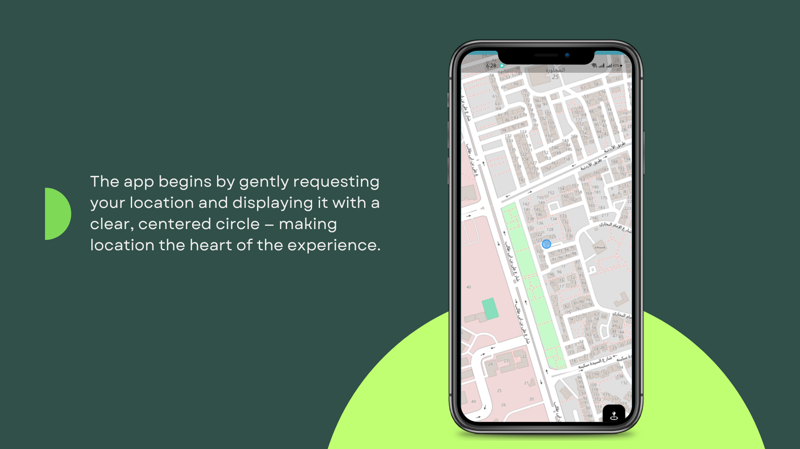
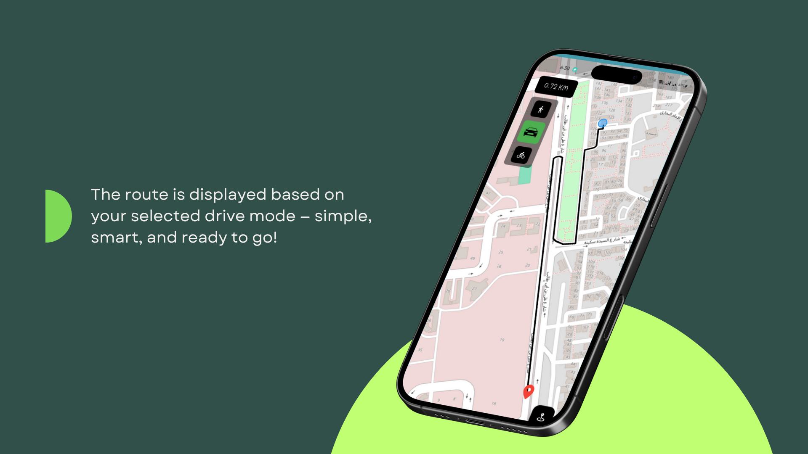

# 🗺️ My Way

A simple Flutter app built as an experiment using [`flutter_map`](https://pub.dev/packages/flutter_map) instead of Google Maps.

## 📸 Screenshots

### 🧭 Location with User Circle

### 📍 Selected Marker & Distance Display

### 🗺️ Route Based on Drive Mode

## 🎯 Purpose

This app is a **practice project** to explore working with:
- `flutter_map` for rendering maps
- Location services using `geolocator`
- Route drawing and polyline handling

## 🛠 Packages Used

- [`flutter_map`](https://pub.dev/packages/flutter_map)
- [`latlong2`](https://pub.dev/packages/latlong2)
- [`geolocator`](https://pub.dev/packages/geolocator)

---

Feel free to explore, fork, or play around with it ✌️
